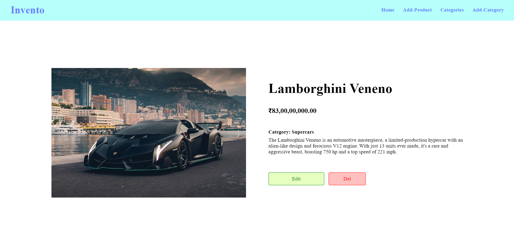
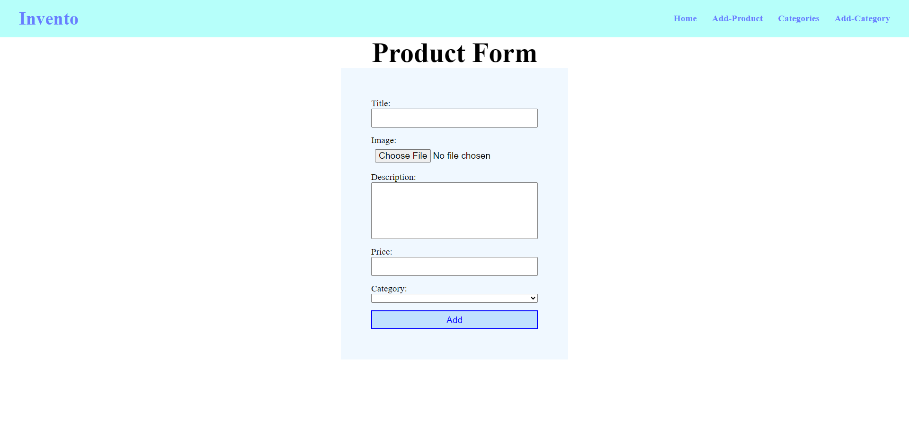
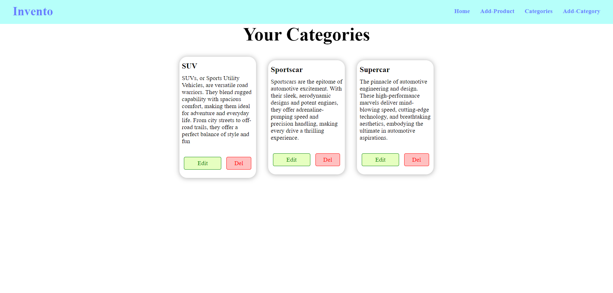

# Inventory management application
### A Project from **[BLUELEARN](https://www.bluelearn.in/)**

Build an Inventory management application for an imaginary store which must have 'categories' and 'items'.
A User can select an category and all the items from that category will become visible in the view.
A Admin can create new product, or edit or delete them.

This Project is built with **Node.js**, **Express.js**, **MySQL** database, **Sequelize ORM**, and for frontend I am using **EJS** templating engine, **CSS** and basic **Javascript** 

## Navigation
- [Inventory management application](#inventory-management-application)
    - [A Project from **BLUELEARN**](#a-project-from-bluelearn)
  - [Navigation](#navigation)
  - [Project Architecture](#project-architecture)
  - [Libraries Used](#libraries-used)
  - [Installation](#installation)
  - [Glimpse of the Project](#glimpse-of-the-project)
  - [Future Updates](#future-updates)
  - [Socials](#socials)

## Project Architecture
I am Not creating seperate folder for each type of file as it will make the project more complex, and it is not neccessary for this kind of small projects.

- **controller.js** : This file will contains all the business logic for each route/page.
- **routes.js** : This file contains code that handles routes.
- **app.js** : Main server file.
- **model.js** : This file contains schema of the data for database,
- **database.js** : This file holds code for making sequelize enviroment connection to database.
- **views/** : This folder holds files that will render at client side.
- **public/** : This folder holds resources to render views files.
- **uploads/** : This folder receive and temporarily stores images/uploads from client side and then delete them after server add those images to database.  


## Libraries Used
Here I will explain the use of libraries that I have implemented in this project.

1. **Body Parser** : With this library it becomes easy to encrypt the incoming data into into proper format. 
   
2. **dotenv** : The confidential details like database passwords and username or details that will differ system to system is stored in **.env** file, this data is known as enviroment variables and to access them in node file we need this library.
3. **EJS** : EJS is a templating engine which helps us to render html pages with dynamic data that comes from server and also allow us to write inline JS logic in html.
4. **Express.js** : Express is Node.js framework that allow us to create and work with servers and routes more easily.
5. **Multer** : Multer library is used to decrypt incoming **file** data and to store them in temporary **uploads/** directory. 
6. **MySQL2** : This library allow us to connect with mysql db and to write and execute sql queries easily. ***I am not using its functionality but this library is required to use Sequelize ORM***
7. **Sequelize** : Sequelize is an sql ORM tool which makes the working with with Database more easily. 


## Installation
1. First fork this repo and then clone it to your local machine.
   ```bash
   git clone https://github.com/Gitax18/inventory-manager.git
   ``` 
2. After cloning change your current directory to project directory
   ```bash
    cd inventory-manager
   ```
3. Now install all the dependencies of the project. (**nodeJS must be installed**)
   ```bash
   npm install
   ```
4. After installing the dependencies create a .env file.
   ```bash
   touch .env
   ```
   and Now write your database details in .env by following given template:
   ```json
   # port details
   port=3000

   # database details
   DB_PASS="<your-database-password>"
   DB_USERNAME="<your-database-username>"
   DB_NAME="inventory_manager"
   ```
    you can copy paste this template to your .env file but remember to replace password and username placeholder.

5. Now your setup is complete and you can start your server by using following command.
   ```bash
   npm start
   ```
## Glimpse of the Project
- **Home Page**
 

- **Product Details Page**
      

- **Add/Edit Product Page**
     

- **Categories**
    

- **Add/Edit Category Page**
      

## Future Updates

- Authentication for admin / customer
- Admin 
  - Dashboard
  - Can give Custom name to shop instead of 'Invento'
  - profile
- Shop 
  - Home page
  - Product page 
  - Cart
  - Orders
  - Profile

- Containariing application with Docker
- Hosting the site, the URL will be like
   - The URL for Each Shop will be like "site-URL/admin-username/shop-name" because every admin has its own shop

## Socials
Anyone who can add above features, or can find or solve an issue feel free to contribute and also connect with me to work on new ideas.

- [Github](https://github.com/Gitax18) 
- [Instagram](https://www.instagram.com/lazydeveloper18/)
- [LinkedIn](https://www.linkedin.com/in/gitanshu-sankhla/)
  
